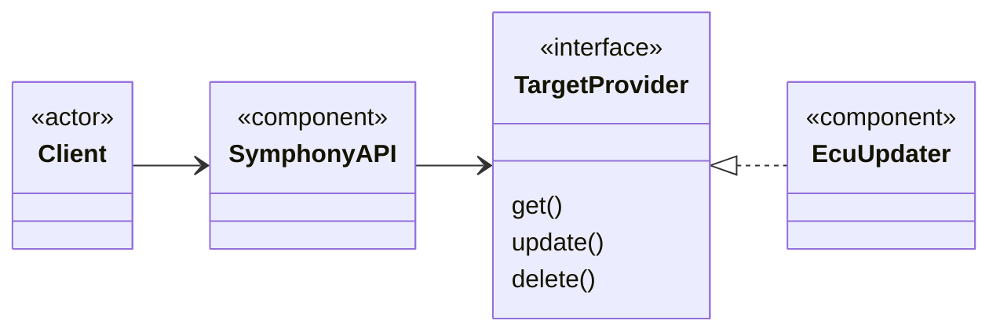

# Running the Example

1. Make sure that you have [installed Docker Compose](https://docs.docker.com/compose/install/) on your workstation.
2. Run the following command:
   ```bash
   docker compose up -d
   ```

This will build the example ECU Updater binary as a container image and start it up together with a Symphony API server.



A client uses the Symphony API server's HTTP interface to manage Symphony entities like _Targets_, _Solutions_ etc. The Symphony API server invokes Target Provider operations on the ECU Updater to manage the state of components being deployed.

## Deploying Firmware to ECUs via Symphony

The Symphony API server allows clients to deploy software _Components_ to _Targets_. The targets are logical representations of the runtime environments for the software like an operating system, a particular device or a Kubernetes cluster. In this example, the ECUs are represented by the _ECU Updater_ target. 

The exampe implementation simply maintains the deployment state in memory and prints corresponding messages to the console. In a real world implementatoin, the updater could use the UDS protocol to actually flash the ECUs with the firmware images.

1. To trigger the installation/update:
   ```bash
   ./trigger_ecu_update.sh
   ```
   This will transfer the [example target definition](./symphony-example/target.json) to the Symphony API server and instruct it to deploy two firmware components to the ECU Updater target.

2. The ECU Updater component will receive a corresponding update command and install the two firmware images. The log file will contain corresponding messages:
   ```bash
   docker logs ecu-updater
   ```
